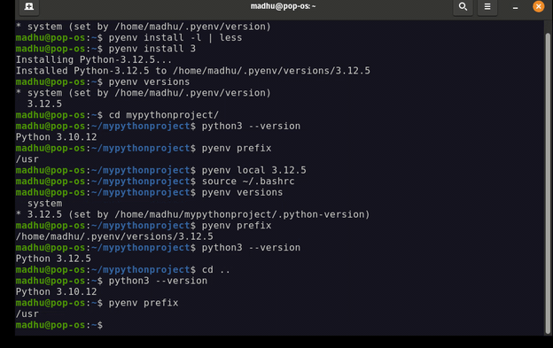

# senialPY

Este proyecto permite controlar un LED conectado a una placa Arduino (o compatible, como ESP32) mediante comandos enviados desde un script de Python a través del puerto serie.



## Requisitos

### Hardware
- Placa Arduino / ESP32.
- LED conectado al pin 2 (o el pin configurado en `senialPY.ino`).
- Cable de datos USB.

### Software
- [Arduino IDE](https://www.arduino.cc/en/software) para cargar el firmware.
- [Python 3.12.5](https://www.python.org/) (Versión definida en `.python-version`).
- [pyenv](https://github.com/pyenv/pyenv) (recomendado para la gestión de versiones).

## Entorno de Desarrollo

Este proyecto se ha desarrollado y probado con el siguiente entorno:

- **OS:** Fedora Linux
- **Python Version:** 3.12.5 (probado también en 3.14.3)
- **Gestión de versiones:** `pyenv`

### Configuración del Entorno con pyenv

El proyecto incluye un archivo `.python-version` que `pyenv` detectará automáticamente. Si tienes instalada la versión 3.12.5, se activará sola al entrar en la carpeta.

```bash
# Instalar la versión si no la tienes
pyenv install 3.12.5

# Si prefieres usar tu versión actual de sistema (ej. 3.14.3)
pyenv local 3.14.3
```

## Estructura del Proyecto

- `senialPY.ino`: Código para la placa Arduino/ESP32 que escucha comandos por el puerto serie.
- `senialpython/`: Carpeta que contiene el cliente Python.
  - `ledOn.py`: Script interactivo para enviar comandos.
  - `venv/`: Entorno virtual de Python.
  - `.python-version`: Archivo de configuración para `pyenv`.

## Configuración y Uso

### 1. Cargar el firmware
1. Abre `senialPY.ino` en tu Arduino IDE.
2. Selecciona tu placa y el puerto serie correcto.
3. Sube el código a la placa.

### 2. Configurar Python
1. Navega a la carpeta del script:
   ```bash
   cd senialpython
   ```
2. Crea y activa el entorno virtual (usando la versión 3.14.3 gestionada por pyenv):
   ```bash
   python -m venv venv
   source venv/bin/activate  # En Linux/macOS
   ```
3. Instala las dependencias:
   ```bash
   pip install pyserial
   ```

### 3. Ejecutar el control
1. Asegúrate de que el puerto serie en `ledOn.py` coincida con el de tu placa (ej: `/dev/ttyUSB0` o `COM3`).
2. Ejecuta el script:
   ```bash
   python ledOn.py
   ```
3. Escribe los comandos en la terminal y pulsa **Enter**:
   - `LED ON`: Enciende el LED.
   - `LED OFF`: Apaga el LED.
   - `q` o `ESC`: Salir del programa.

## Notas
- La velocidad de comunicación está configurada a **115200 baudios**.
- El script de Python utiliza un búfer para permitir la escritura interactiva antes de enviar el comando completo.
